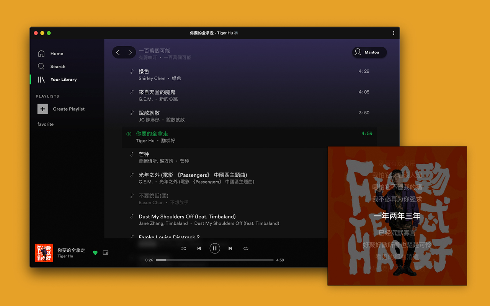

## Spotify Lyrics

Install Extension: [Chrome](https://chrome.google.com/webstore/detail/spotify-lyrics/mkjfooclbdgjdclepjeepbmmjaclipod) | Firefox(Coming Soon)

When you open the PiP(album cover) window, the lyrics are automatically displayed in it.

If you have any questions, please submit an [issue](https://github.com/mantou132/Spotify-Lyrics/issues).



## How To Work

1. [Listen](https://developer.mozilla.org/en-US/docs/Web/API/MutationObserver) for `.track_info` element.
2. Search for songs and download lyrics using [`NeteaseCloudMusicApi`](https://github.com/Binaryify/NeteaseCloudMusicApi).
3. Rendering lyrics to `<canvas>` using [SVG](https://developer.mozilla.org/en-US/docs/Web/SVG/Element/foreignObject).
4. [Capture](https://developer.mozilla.org/en-US/docs/Web/API/HTMLCanvasElement/captureStream) video stream from `<canvas>` and merge onto original cover stream.
5. Update lyrics scroll position with a [loop](https://developer.mozilla.org/en-US/docs/Web/API/WindowOrWorkerGlobalScope/setTimeout).

## Compatibility

* Firefox does not currently support [PiP WebAPI](https://bugzilla.mozilla.org/show_bug.cgi?id=1463402)
* Chrome [70+](https://caniuse.com/#feat=picture-in-picture)

## Development

```bash
# step 1
npm run watch
# open a new terminal
# step 2
npm run start
```

## TODO

* Song matching optimization
* Debuging info
* Unit test
* CI/CD

## Help

The extension requires a stable `NeteaseCloudMusicApi` service or
other better lyrics service.