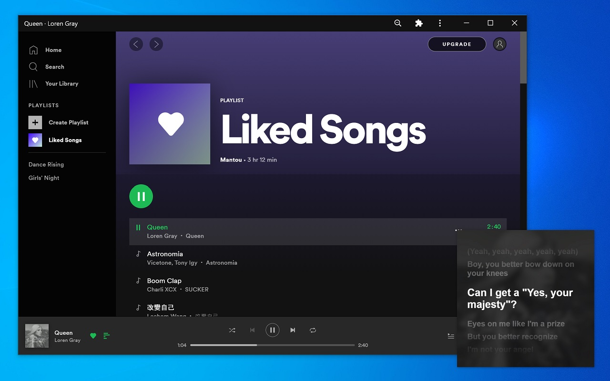

[](https://travis-ci.org/mantou132/Spotify-Lyrics)

# Spotify Lyrics

Install Extension: [Chrome](https://chrome.google.com/webstore/detail/spotify-lyrics/mkjfooclbdgjdclepjeepbmmjaclipod) | [Firefox](https://addons.mozilla.org/en-US/firefox/addon/spotify-lyrics/) | [Safari](https://github.com/mantou132/Spotify-Lyrics/releases)

Add lyrics button, when activated, the lyrics are displayed in the Picture-in-Picture window.

If you have any questions, please submit an [issue](https://github.com/mantou132/Spotify-Lyrics/issues).



## How To Work

1. [Listen](https://developer.mozilla.org/en-US/docs/Web/API/MutationObserver) for track info element.
2. Search for songs and download lyrics using [`NeteaseCloudMusicApi`](https://github.com/Binaryify/NeteaseCloudMusicApi).
3. Rendering lyrics to `<canvas>` using [SVG](https://developer.mozilla.org/en-US/docs/Web/SVG/Element/foreignObject).
4. [Capture](https://developer.mozilla.org/en-US/docs/Web/API/HTMLCanvasElement/captureStream) video stream from `<canvas>` and merge cover image.
5. Update lyrics scroll position with a [loop](https://developer.mozilla.org/en-US/docs/Web/API/WindowOrWorkerGlobalScope/setTimeout).

## Compatibility

* Firefox does not currently support [PiP WebAPI](https://bugzilla.mozilla.org/show_bug.cgi?id=1463402)
* Chrome [70+](https://caniuse.com/#feat=picture-in-picture)
* Safari [14+](https://developer.apple.com/documentation/safariservices/safari_web_extensions)

## Recommend

* [Install as PWA](https://support.google.com/chrome/answer/9658361)(only Chrome)

## Development

Requirement: [Node.js](https://nodejs.org)

```bash
# install dependencies
npm install
# start develop
npm run start
```

Build:
```bash
npm run build:zip
```

## TODO

* Song matching optimization
* Debuging info
* Unit test
* CI/CD

## Help

The extension requires a stable `NeteaseCloudMusicApi` service or
other better lyrics service.