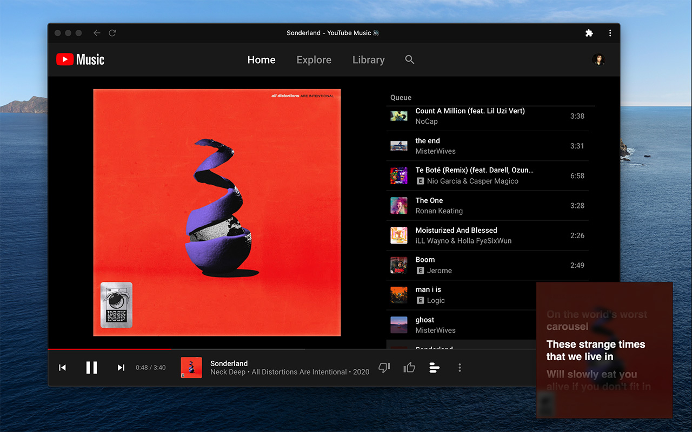

[](https://discord.com/invite/fQbzzdJ)

# Spotify Lyrics

## Siegrain update

Add romaji support for Japanese and Korean lyrics.


---
Install Extension:
- Chrome/Chromium/Firefox: Download the zip on the [release](https://github.com/mantou132/Spotify-Lyrics/releases) page, and then load the extension on the extension management page of the browser. [reason](https://github.com/mantou132/Spotify-Lyrics/issues/68).
- Safari(Soon)

The extension adds a button to the bottom left corner of Spotify Web Player,
Click to switch the display status of the lyrics,
which is displayed in the Picture-in-Picture window by default setting.
Spotify can be [installed as pwa](https://support.google.com/chrome/answer/9658361) instead of desktop client.

If you have any questions, please submit an [issue](https://github.com/mantou132/Spotify-Lyrics/issues).


The extension also supports Youtube Music, Apple Music, Deezer and Tidal, but songs with videos in Youtube Music cannot be perfectly supported(because the duration of the video is different from the duration of the officially released audio track).



## How To Work

1. [Listen](https://developer.mozilla.org/en-US/docs/Web/API/MutationObserver) for track info element.
2. Search for songs and download lyrics using [`NeteaseCloudMusicApi`](https://github.com/Binaryify/NeteaseCloudMusicApi).
3. Rendering lyrics to [`<canvas>`](https://developer.mozilla.org/en-US/docs/Web/API/CanvasRenderingContext2D).
4. [Capture](https://developer.mozilla.org/en-US/docs/Web/API/HTMLCanvasElement/captureStream) video stream from `<canvas>` and merge cover image.
5. Update lyrics scroll position with a [loop](https://developer.mozilla.org/en-US/docs/Web/API/window/requestAnimationFrame).

## Compatibility

- Firefox [78+](https://bugzilla.mozilla.org/show_bug.cgi?id=1361876) (Not support [PiP](https://bugzilla.mozilla.org/show_bug.cgi?id=1463402))
- Edge [79+](https://blogs.windows.com/msedgedev/2020/01/15/upgrading-new-microsoft-edge-79-chromium/)
- Chrome [70+](https://caniuse.com/#feat=picture-in-picture)
- Safari [14+](https://developer.apple.com/documentation/safariservices/safari_web_extensions)

## Development

Requirement: [Node.js](https://nodejs.org)

```bash
# install dependencies
yarn
# start develop
yarn run start
# optional: start firebase function simulation
yarn run start:firebase
```

Build:

```bash
yarn run build:zip

# firebase depoly and config update
# npm i -g firebase-tools
firebase depoly
firebase functions:config:get
firebase functions:config:set spotify-lyrics.manager-ids=xxx
```

## Match Success Rate

Spotify, v1.2.7, Friday, July 31, 2020

| Playlist Name             | Success rate | Success | No Match | No Lyrics |
| ------------------------- | ------------ | ------- | -------- | --------- |
| Global Top 50             | 94%          | 47      | 1        | 2         |
| Argentina Top 50          | 62%          | 31      | 9        | 10        |
| Australia Top 50          | 96%          | 48      | 1        | 1         |
| Austria Top 50            | 78%          | 39      | 6        | 5         |
| Belgium Top 50            | 94%          | 47      | 2        | 1         |
| Bolivia Top 50            | 80%          | 40      | 6        | 4         |
| Brazil Top 50             | 24%          | 12      | 12       | 26        |
| Bulgaria Top 50           | 66%          | 33      | 1        | 16        |
| Canada Top 50             | 100%         | 50      | 0        | 0         |
| Chile Top 50              | 80%          | 40      | 5        | 5         |
| Colombia Top 50           | 78%          | 39      | 7        | 4         |
| Costa Rica Top 50         | 76%          | 38      | 7        | 5         |
| Czech Republic Top 50     | 54%          | 27      | 7        | 16        |
| Denmark Top 50            | 58%          | 29      | 1        | 20        |
| Dominican Republic Top 50 | 78%          | 39      | 5        | 6         |
| Ecuador Top 50            | 78%          | 39      | 7        | 4         |
| El Salvador Top 50        | 78%          | 39      | 7        | 4         |
| Estonia Top 50            | 58%          | 29      | 4        | 17        |
| Finland Top 50            | 60%          | 30      | 0        | 20        |
| France Top 50             | 64%          | 32      | 2        | 16        |
| Germany Top 50            | 80%          | 40      | 7        | 3         |
| Greece Top 50             | 38%          | 19      | 4        | 27        |
| Guatemala Top 50          | 82%          | 41      | 6        | 3         |
| Honduras Top 50           | 78%          | 39      | 7        | 4         |
| Hong Kong Top 50          | 80%          | 40      | 10       | 0         |
| Hungary Top 50            | 80%          | 40      | 3        | 7         |
| Iceland Top 50            | 60%          | 30      | 4        | 16        |
| India Top 50              | 52%          | 26      | 9        | 15        |
| Indonesia Top 50          | 62%          | 31      | 4        | 15        |
| Ireland Top 50            | 100%         | 50      | 0        | 0         |
| Israel Top 50             | 62%          | 31      | 6        | 13        |
| Italy Top 50              | 76%          | 38      | 4        | 8         |
| Japan Top 50              | 52%          | 26      | 19       | 5         |
| Latvia Top 50             | 90%          | 45      | 1        | 4         |
| Lithuania Top 50          | 68%          | 34      | 11       | 5         |
| Luxembourg Top 50         | 84%          | 42      | 4        | 4         |
| Malaysia Top 50           | 88%          | 44      | 3        | 3         |
| Mexico Top 50             | 76%          | 38      | 7        | 5         |
| Netherlands Top 50        | 72%          | 36      | 2        | 12        |
| New Zealand Top 50        | 96%          | 48      | 0        | 2         |
| Nicaragua Top 50          | 80%          | 40      | 6        | 4         |
| Norway Top 50             | 82%          | 41      | 1        | 8         |
| Panama Top 50             | 80%          | 40      | 6        | 4         |
| Paraguay Top 50           | 80%          | 40      | 7        | 3         |
| Peru Top 50               | 80%          | 40      | 5        | 5         |
| Philippines Top 50        | 82%          | 41      | 4        | 5         |
| Poland Top 50             | 30%          | 15      | 26       | 9         |
| Portugal Top 50           | 66%          | 33      | 2        | 15        |
| Romania Top 50            | 58%          | 29      | 6        | 15        |
| Russia Top 50             | 54%          | 27      | 16       | 7         |
| Singapore Top 50          | 88%          | 44      | 6        | 0         |
| Slovakia Top 50           | 62%          | 31      | 10       | 9         |
| South Africa Top 50       | 98%          | 49      | 0        | 1         |
| Spain Top 50              | 72%          | 36      | 4        | 10        |
| Sweden Top 50             | 80%          | 40      | 7        | 3         |
| Switzerland Top 50        | 88%          | 44      | 5        | 1         |
| Taiwan Top 50             | 68%          | 34      | 16       | 0         |
| Thailand Top 50           | 82%          | 41      | 9        | 0         |
| Turkey Top 50             | 50%          | 25      | 4        | 21        |
| Ukraine Top 50            | 76%          | 38      | 7        | 5         |

## Contribution

Fork it, submit PR.

- Add translation
- If you can write code, you can fix [bugs](https://github.com/mantou132/Spotify-Lyrics/issues?q=is%3Aissue+is%3Aopen+label%3Abug) or improve [performance](https://github.com/mantou132/Spotify-Lyrics/issues?q=is%3Aissue+is%3Aopen+label%3Aperformance)
- Optimize the matching rate of Chinese, Japanese and Korean lyrics.(edit [config.json](./src/page/config.json)). _Note: The extension already has automatic optimization, this list serves as a supplement_ . _[Unmatched lyrics report](https://datastudio.google.com/reporting/bfd79c68-f9f4-4af5-8e51-a12d3d6be450)_


## Privacy Policy

[see](./public/privacy-policy.html).
